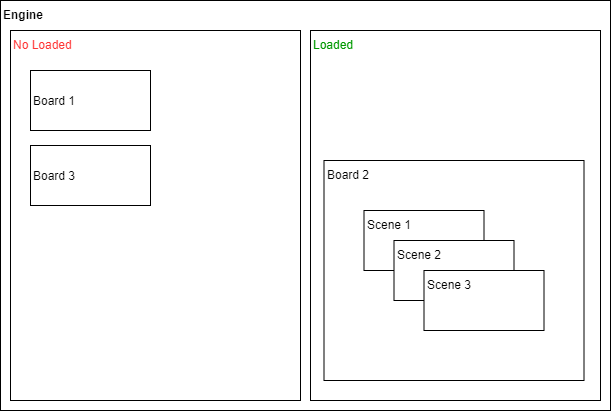
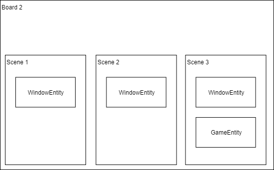

# GameAndroidBase

Este projeto se encontra em atualização.

### Descrição

Este projeto tem como objetivo oferecer uma base de programação para o desenvolvimento de jogos para Android.

### Suporte a desenho:
- [X] Canvas
- [ ] OpenGL

### Funcionamento: **Boards** e **Scenes**
Basicamente, a engine possui um gerenciador de **Boards**, sendo que somente uma **Board**, por padrão, é carregada na memória por vez.

Cada board possui uma lista de **Scene (Cenas)**, que são usadas para dividir o contexto de uma **Board** em subcontextos.



Exemplo: No menu principal do jogo, uma cena para cada menu, ou uma cena para uma animação rodando por trás da cena que cuida do menu.



### Uso: **Boards** e **Scenes**
Para uma nova **Board**, é necessario criar uma nova classe e estender a **Board**. Por padrão, use o construtor somente para inicializações leves, e na função **init()** coloque o carregamento dos componentes a serem utilizados. (Cenas, texturas, etc.).
```java
public class MinhaBoard extends Board {

  public MinhaBoard(int x, int y, int alrgura, int altura) {
    super(x, y, largura, altura);
  }
  
  @Override
  public void init() {
  }

}
```

E para mostrar sua nova **Board**, deve-se ir na classe **GameEngine**, na função **initComponent()**, e na linha comentada com **INICIE SUA BOARD AQUI**, comente a instancia feita, e coloque a sua, fornecendo x e y para posição, e a largura e altura desejada.:

```java
Trecho de codigo acima omitido.
.......
     private void initComponents() {
        this.soundManager = new SoundManager(getContext());
        this.deviceManager = new DeviceManager();

        // --------------------------------
        // INICIE SUA BOARD AQUI

        // this.board = new GameBoard(0,0, GameParameters.getInstance().screenSize.right, GameParameters.getInstance().screenSize.bottom);
        this.board = new MyBoard( posiçãoEmXdaBoard, posiçãoEmYdaBoard, larguraDaBoard, alturaDaBoard );

        // --------------------------------
        this.board.setSoundManager(this.soundManager);
        this.board.setDeviceManager(this.deviceManager);
        this.board.init();
    }
........
Trecho de codigo abaixo omitido.
```

Para uma nova cena, define a mesma na sua **Board** criada, e instancie ela na função **init()** da **Board**, fornecendo x e y para posição, e a largura e altura desejada. Após deve-se adicionar a cena na **Board** fazendo a chamada a **super.add()**. Só depois de adicionada, seus componentes serão inicializados e exibidos.

```java
public class MinhaBoard extends Board {

  Scene minhaScene;

  public MinhaBoard() {
    super(x, y, largura, altura);
  }
  
  @Override
  public void init() {
    minhaScene = new Scene(posiçãoEmXdaCena, posiçãoEmYdaCena, larguraDaCena, alturaDaCena);
    super.add(minhaScene);
  }

}
```
